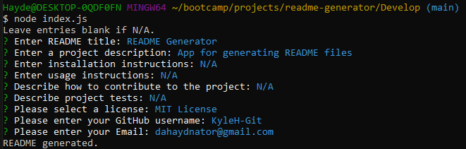
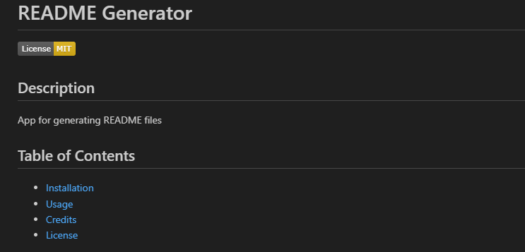

# README Generator

## Description
An app to easily generate ReadMe files.

## Usage
This app requires the Node JS RTE installed. To use the app using your command line navigate to the directory that has the index.js file downloaded from the repository. Once there, type the command node index.js to run the JavaScript. The command line will prompt you with several questions that when answered, will be converted to Markdown and stored in the README.md file inside of the develop folder.

## Installation 
Requires that https://nodejs.org/en be installed to properly be able to run the JavaScript locally.
You can clone the repository to your local machine, or copy the files directly from the repository.

## License

MIT License

Copyright (c) [2024] [Kyle Hayden]

Permission is hereby granted, free of charge, to any person obtaining a copy of this software and associated documentation files (the "Software"), to deal in the Software without restriction, including without limitation the rights to use, copy, modify, merge, publish, distribute, sublicense, and/or sell copies of the Software, and to permit persons to whom the Software is furnished to do so, subject to the following conditions:

The above copyright notice and this permission notice shall be included in all copies or substantial portions of the Software.

THE SOFTWARE IS PROVIDED "AS IS", WITHOUT WARRANTY OF ANY KIND, EXPRESS OR IMPLIED, INCLUDING BUT NOT LIMITED TO THE WARRANTIES OF MERCHANTABILITY, FITNESS FOR A PARTICULAR PURPOSE AND NONINFRINGEMENT. IN NO EVENT SHALL THE AUTHORS OR COPYRIGHT HOLDERS BE LIABLE FOR ANY CLAIM, DAMAGES OR OTHER LIABILITY, WHETHER IN AN ACTION OF CONTRACT, TORT OR OTHERWISE, ARISING FROM, OUT OF OR IN CONNECTION WITH THE SOFTWARE OR THE USE OR OTHER DEALINGS IN THE SOFTWARE.